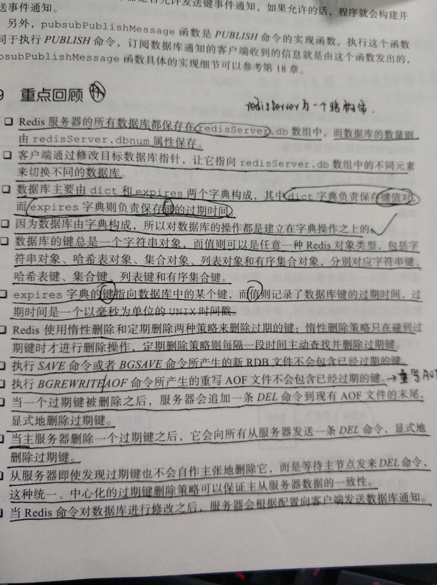
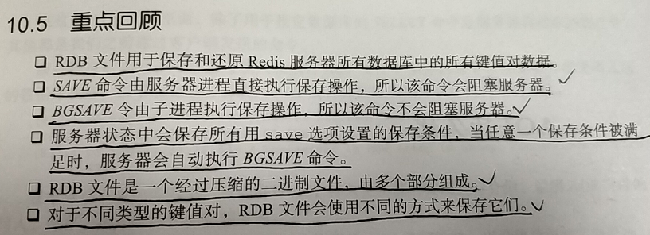
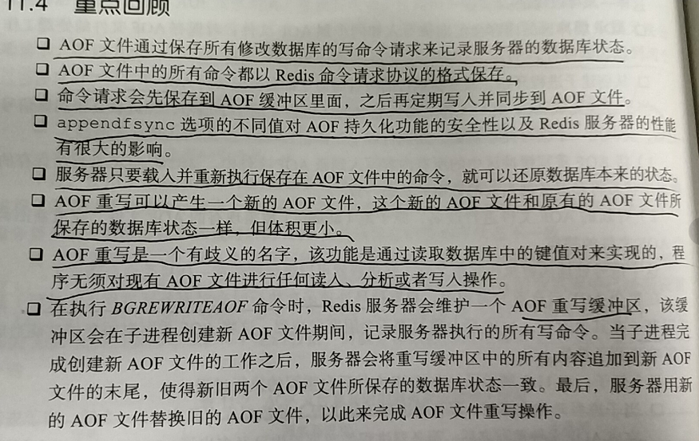

redis 学习笔记

一、数据结构与对象

简单动态字符串（simple dynamic string ,SDS）

优点，

redis对象：

字符串对象

列表对象

哈希表对象

集合对象

有序集合对象

键值对的键对象只能是字符串对象。

键值对的值对象是redis五种对象之一。

| key        | value                                             |
| ---------- | ------------------------------------------------- |
| 字符串对象 | 字符串对象                                        |
| 字符串对象 | 列表对象                                          |
| 字符串对象 | 哈希表对象（dict）{key1:value1,key2:value2, ....} |
| 字符串对象 | 几何对象                                          |
| 字符串对象 | 有序集合对象                                      |

#### 过期键删除策略

定时删除：设置定时器。当过期时间来临，立刻执行

惰性删除：每次获取键时。才判断是否过期，如果过期就删除，否则返回内容

定期删除：每隔一定时间，分多次遍历服务器的多个数据库。从数据库的expire字典中随机检查一部分键的过期时间，并删除其中的过期键。

redis 使用的是惰性删除和定期删除，合理利用CPU。

### RDB持久化总结

AOF持久化总结

### 总结：

最近在项目中使用到Redis做缓存，方便多个业务进程之间共享数据。由于Redis的数据都存放在内存中，如果没有配置持久化，redis重启后数据就全丢失了，于是需要开启redis的持久化功能，将数据保存到磁盘上，当redis重启后，可以从磁盘中恢复数据。redis提供两种方式进行持久化，一种是RDB持久化（原理是将Reids在内存中的数据库记录定时dump到磁盘上的RDB持久化），另外一种是AOF持久化（原理是将Reids的操作日志以追加的方式写入文件）。那么这两种持久化方式有什么区别呢，改如何选择呢？网上看了大多数都是介绍这两种方式怎么配置，怎么使用，就是没有介绍二者的区别，在什么应用场景下使用。

#### 2、二者的区别

RDB持久化是指在指定的时间间隔内将内存中的数据集快照写入磁盘，实际操作过程是fork一个子进程，先将数据集写入临时文件，写入成功后，再替换之前的文件，用二进制压缩存储。

AOF持久化以日志的形式记录服务器所处理的每一个写、删除操作，查询操作不会记录，以文本的方式记录，可以打开文件看到详细的操作记录。

#### 3、二者优缺点

#### RDB存在哪些优势呢？

1). 一旦采用该方式，那么你的整个Redis数据库将只包含一个文件，这对于文件备份而言是非常完美的。比如，你可能打算每个小时归档一次最近24小时的数据，同时还要每天归档一次最近30天的数据。通过这样的备份策略，一旦系统出现灾难性故障，我们可以非常容易的进行恢复。

2). 对于灾难恢复而言，RDB是非常不错的选择。因为我们可以非常轻松的将一个单独的文件压缩后再转移到其它存储介质上。

3). 性能最大化。对于Redis的服务进程而言，在开始持久化时，它唯一需要做的只是fork出子进程，之后再由子进程完成这些持久化的工作，这样就可以极大的避免服务进程执行IO操作了。

4). 相比于AOF机制，如果数据集很大，RDB的启动效率会更高。

RDB又存在哪些劣势呢？

1). 如果你想保证数据的高可用性，即最大限度的避免数据丢失，那么RDB将不是一个很好的选择。因为系统一旦在定时持久化之前出现宕机现象，此前没有来得及写入磁盘的数据都将丢失。

2). 由于RDB是通过fork子进程来协助完成数据持久化工作的，因此，如果当数据集较大时，可能会导致整个服务器停止服务几百毫秒，甚至是1秒钟。

#### AOF的优势有哪些呢？

1). 该机制可以带来更高的数据安全性，即数据持久性。Redis中提供了3中同步策略，即每秒同步、每修改同步和不同步。事实上，每秒同步也是异步完成的，其效率也是非常高的，所差的是一旦系统出现宕机现象，那么这一秒钟之内修改的数据将会丢失。而每修改同步，我们可以将其视为同步持久化，即每次发生的数据变化都会被立即记录到磁盘中。可以预见，这种方式在效率上是最低的。至于无同步，无需多言，我想大家都能正确的理解它。

2). 由于该机制对日志文件的写入操作采用的是append模式，因此在写入过程中即使出现宕机现象，也不会破坏日志文件中已经存在的内容。然而如果我们本次操作只是写入了一半数据就出现了系统崩溃问题，不用担心，在Redis下一次启动之前，我们可以通过redis-check-aof工具来帮助我们解决数据一致性的问题。

3). 如果日志过大，Redis可以自动启用rewrite机制。即Redis以append模式不断的将修改数据写入到老的磁盘文件中，同时Redis还会创建一个新的文件用于记录此期间有哪些修改命令被执行。因此在进行rewrite切换时可以更好的保证数据安全性。

4). AOF包含一个格式清晰、易于理解的日志文件用于记录所有的修改操作。事实上，我们也可以通过该文件完成数据的重建。

AOF的劣势有哪些呢？

1). 对于相同数量的数据集而言，AOF文件通常要大于RDB文件。RDB 在恢复大数据集时的速度比 AOF 的恢复速度要快。

2). 根据同步策略的不同，AOF在运行效率上往往会慢于RDB。总之，每秒同步策略的效率是比较高的，同步禁用策略的效率和RDB一样高效。

二者选择的标准，就是看系统是愿意牺牲一些性能，换取更高的缓存一致性（aof），还是愿意写操作频繁的时候，不启用备份来换取更高的性能，待手动运行save的时候，再做备份（rdb）。rdb这个就更有些 eventually consistent的意思了。

#### 4、常用配置

#### RDB持久化配置

Redis会将数据集的快照dump到dump.rdb文件中。此外，我们也可以通过配置文件来修改Redis服务器dump快照的频率，在打开6379.conf文件之后，我们搜索save，可以看到下面的配置信息：

save 900 1              #在900秒(15分钟)之后，如果至少有1个key发生变化，则dump内存快照。

save 300 10            #在300秒(5分钟)之后，如果至少有10个key发生变化，则dump内存快照。

save 60 10000        #在60秒(1分钟)之后，如果至少有10000个key发生变化，则dump内存快照。

#### AOF持久化配置

在Redis的配置文件中存在三种同步方式，它们分别是：

appendfsync always     #每次有数据修改发生时都会写入AOF文件。

appendfsync everysec  #每秒钟同步一次，该策略为AOF的缺省策略。

appendfsync no          #从不同步。高效但是数据不会被持久化。

## AOF重写

为了解决AOF文件体积膨胀的问题，Redis提供了AOF文件重写功能。

AOF文件重写是通过读取服务器当前数据库状态来实现的，与现有的AOF文件没任何关系，不会对现有的AOF文件进行任何的读取、分析或者写入操作。

Redis 将AOF重写程序放到子进程中直行，防止服务器因AOF重写而无法处理请求。

**Redis使用子进程处理AOF重写的好处：**
\- 子进程进行AOF重写期间，服务器进程可以继续处理命令请求
\- 子进程带有服务器进程的数据副本，使用子进程而不是线程，可以在避免使用锁的情况下，保证数据的安全性

###  如何解决子进程AOF重写期间，服务器数据库状态与重写后的AOF文件数据库状态不一致的情况

为了解决数据不一致的问题，Redis服务器设置了一个AOF重写缓冲区，这个缓存区在服务器创建了子进程之后开始使用，当Redis服务器执行完一个写命令后，它会同时将这个写命令发送给AOF缓存区和AOF重写缓存区。

当子进程完成重写工作后，向父进程发送一个信号，父进程接收到信号后，调用信号处理函数（这个过程服务器进程是阻塞的，不能处理新命令请求）：

- 将AOF 重写缓冲区中的所有内容写入新的AOF文件
- 原子地覆盖现有的AOF文件

**什么时候触发AOF重写子进程？**

那么问题来了，什么时候fork一个子程序进行AOF重写呢？就是说在什么样的情况下，需要AOF重写呢？有两种方案

- **AOF** **重写可以由用户通过调用** **BGREWRITEAOF** **手动触发**。
- **AOF重写可以通过配置设置成为自动出发。服务器在 AOF 功能开启的情况下，会维持 三个变量：录当前 AOF 文件大小的变量 aof_current_size，记录最后一次 AOF 重写之后，AOF 文件大小的变量 aof_rewirte_base_size，增长百分比变量 aof_rewirte_perc 。**

　　每次当 serverCron 函数执行时，它都会检查以下条件是否全部满足，如果是的话，就会触发自动的 AOF 重写 ：
   　　　　1. 没有 BGSAVE 命令在进行。
            　　　　2. 没有 BGREWRITEAOF 在进行。
            　　　　3. 当前 AOF 文件大小大于 server.aof_rewrite_min_size （默认值为 1 MB）。
                  　　　　4. 当前 AOF 文件大小和最后一次 AOF 重写后的大小之间的比率大于等于指定的增长百分比。
                  　　　　5. 默认情况下，增长百分比为 100% ，也即是说，如果前面三个条件都已经满足，并且当前 AOF文件大小比最后一次 AOF 重写时的大小要大一倍的话，那么触发自动 AOF 重写 

reids集群方面知识点：

1、复制

2、Sentinel

3、集群

4、事务

## 2 缓存穿透

### 2.1 什么是缓存穿透

正常情况下，我们去查询数据都是存在。那么请求去查询一条压根数据库中根本就不存在的数据，也就是缓存和数据库都查询不到这条数据，但是请求每次都会打到数据库上面去。

这种查询不存在数据的现象我们称为缓存穿透。

### 2.2 穿透带来的问题

试想一下，如果有黑客会对你的系统进行攻击，拿一个不存在的id 去查询数据，会产生大量的请求到数据库去查询。可能会导致你的数据库由于压力过大而宕掉。

### 2.3 解决办法

#### 2.3.1 缓存空值

之所以会发生穿透，就是因为缓存中没有存储这些空数据的key。从而导致每次查询都到数据库去了。

那么我们就可以为这些key 设置的值设置为null 丢到缓存里面去。后面再出现查询这个key 的请求的时候，直接返回null ,就不用在到 数据库中去走一圈了。但是别忘了设置过期时间。

#### 2.3.2 BloomFilter

BloomFilter 类似于一个hase set 用来判断某个元素（key）是否存在于某个集合中。具体概念

这种方式在大数据场景应用比较多，比如 Hbase 中使用它去判断数据是否在磁盘上。还有在爬虫场景判断url 是否已经被爬取过。

这种方案可以加在第一种方案中，在缓存之前在加一层 BloomFilter ，在查询的时候先去 BloomFilter 去查询 key 是否存在，如果不存在就直接返回，存在再走查 缓存 -> 查 DB。

流程图如下：

### 2.4 如何选择

针对于一些恶意攻击，攻击带过来的大量key 是不存在的，那么我们采用第一种方案就会缓存大量不存在 key 的数据。此时我们采用第一种方案就不合适了，我们完全可以先对使用第二种方案进行过滤掉这些key。

针对这种key 异常多，请求重复率比较低的数据，我们就没有必要进行缓存，使用第二种方案直接过滤掉。

对于空数据的key 有限的，重复率比较高的，我们则可以采用第一种方式进行缓存。

## 3 缓存击穿

### 3.1 什么是击穿

缓存击穿是我们可能遇到的第二个使用缓存方案可能遇到的问题。

在平常高并发的系统中，大量的请求同时查询一个 key 时，此时 这个key 正好失效了，就会导致大量的请求都打到数据库上面去。这种现象我们成为击穿。

### 3.2 会带来什么问题

会造成某一时刻数据库请求量过大，压力剧增。

### 3.3 如何解决

上面的现象是多个线程同时去查询数据库的这条数据，那么我们可以在第一个查询数据的请求上使用一个 互斥锁来锁住它。其他的线程走到这一步拿不到锁就等着，等第一个线程查询到了数据，然后做缓存。后面的线程进来发现已经有缓存了，就直接走缓存。

## 4、缓存雪崩

### 4.1 什么是缓存雪崩

缓存的情况是说，当某一时刻发生大规模的缓存失效的情况。比如你的缓存服务宕机了，会有大量的请求进来直接打到DB上面。结果就是DB 称不住，挂掉。

### 4.2 解决办法

#### 4.2.1 事前：使用集群缓存，保证缓存服务的高可用

这种方案就是在发生雪崩前对缓存集群实现高可用，如果是使用 Redis，可以使用 主从+哨兵 ，Redis Cluster 来避免 Redis 全盘崩溃的情况。

#### 4.2.2 事中：使用 ehcache 本地缓存 + Hystrix 限流&降级 ,避免 MySQL 被打死的情况发生。

使用 ehcache 本地缓存的目的也是考虑在 Redis Cluster 完全不可用的时候，ehcache 本地缓存还能够支撑一阵。

使用 Hystrix 进行 限流 & 降级 ，比如一秒来了5000个请求，我们可以设置假设只能有一秒 2000 个请求能通过这个组件，那么其他剩余的 3000 请求就会走限流逻辑，然后去调用我们自己开发的降级组件（降级）。比如设置的一些默认值呀之类的。以此来保护最后的 MySQL 不会被大量的请求给打死。

#### 4.2.3 事后：开启 Redis 持久化机制，尽快恢复缓存集群

一旦重启，就能从磁盘上自动加载数据恢复内存中的数据。

防止雪崩方案如下图所示：

## 5 热点数据集中失效问题怎么解决

我们在设置缓存的时候，一般会给缓存设置一个失效时间，过了这个时间，缓存就失效了。对于一些热点的数据来说，当缓存失效以后会存在大量的请求过来，然后打到数据库去，从而可能导致数据库崩溃的情况。

### 5.1 解决办法

#### 5.1.1 设置不同的失效时间

为了避免这些热点的数据集中失效，那么我们在设置缓存过期时间的时候，我们让他们失效的时间错开。比如在一个基础的时间上加上或者减去一个范围内的随机值。

#### 5.1.2 互斥锁

结合上面的击穿的情况，在第一个请求去查询数据库的时候对他加一个互斥锁，其余的查询请求都会被阻塞住，直到锁被释放，从而保护数据库。但是也是由于它会阻塞其他的线程，此时系统吞吐量会下降。需要结合实际的业务去考虑是否要这么做。

