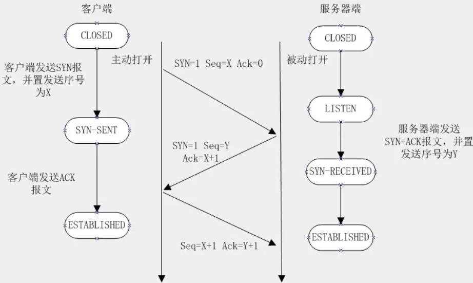

在我们点击一个网址，到它能够呈现在浏览器中，展示在我们面前，这个过程中，电脑里，网络上，究竟发生了什么事情。

# 服务器启动监听模式

那我们就开始了，故事其实并不是从在浏览器的地址栏输入一个网址，或者我们抓着鼠标点击一个链接开始，事情的开端要追溯到服务器启动监听服务的时候，在某个未知的时刻，一台机房里普普通通的刀片服务器，加上电，启动了操作系统，随着操作系统的就绪，服务器启动了 http 服务进程，这个 http 服务的守护进程，（daemon），可能是 apache，也可能是 nginx，不管怎么说，这个 http 服务进程开始定位到服务器上的 www 文件夹，一般是位于 /var/www ，然后启动了一些附属的模块，例如 php，或者，使用 fastcgi 方式连接到 php 的 fpm 管理进程，然后，向操作系统申请了一个 tcp 连接，然后绑定在了 80 端口，调用了 accept 函数，开始了默默的监听，监听着可能来自位于地球任何一个地方的请求，随时准备做出响应。

这个时候，典型的情况下，机房里面应该还有一个数据库服务器，或许，还有一台缓存服务器，如果对于流量巨大的网站，那么动态脚本的解释器可能还有单独的物理机器来跑，如果是中小的站点，那么，上述的各色服务，甚至都可能在一台物理机上，这些服务监听之间的关系。不管怎么说，他们做好了准备，静候差遣。

# 客户端浏览器发送请求

## 1. 解析URL

## 2. 输入的是 URL 还是搜索的关键字？

当协议或主机名不合法时，浏览器会将地址栏中输入的文字传给默认的搜索引擎。大部分情况下，在把文字传递给搜索引擎的时候，URL会带有特定的一串字符，用来告诉搜索引擎这次搜索来自这个特定浏览器。

## 3. 转换非 ASCII 的 Unicode 字符

- 浏览器检查输入是否含有不是 a-z， A-Z，0-9， - 或者 . 的字符

- 这里主机名是 google.com ，所以没有非ASCII的字符；如果有的话，浏览器会对主机名部分使用 Punycode 编码

  ## 4. 检查 HSTS 列表

- 浏览器检查自带的“预加载 HSTS（HTTP严格传输安全）”列表，这个列表里包含了那些请求浏览器只使用HTTPS进行连接的网站

- 如果网站在这个列表里，浏览器会使用 HTTPS 而不是 HTTP 协议，否则，最初的请求会使用HTTP协议发送

- 注意，一个网站哪怕不在 HSTS 列表里，也可以要求浏览器对自己使用 HSTS 政策进行访问。浏览器向网站发出第一个 HTTP 请求之后，网站会返回浏览器一个响应，请求浏览器只使用 HTTPS 发送请求。然而，就是这第一个 HTTP 请求，却可能会使用户收到 downgrade attack 的威胁，这也是为什么现代浏览器都预置了 HSTS 列表。

## 5. dns查询

- 浏览器缓存查询：浏览器检查域名是否在缓存当中（要查看 Chrome 当中的缓存， 打开 chrome://net-internals/#dns）。
- 本地host查询：如果缓存中没有，就去调用 gethostbyname 库函数（操作系统不同函数也不同）进行查询，gethostbyname 函数在试图进行DNS解析之前首先检查域名是否在本地 Hosts 里，Hosts 的位置 不同的操作系统有所不同
- 发送DNS 查询请求：如果 gethostbyname 没有这个域名的缓存记录，也没有在 hosts 里找到，它将会向 DNS 服务器发送一条 DNS 查询请求。DNS 服务器是由网络通信栈提供的，通常是本地路由器或者 ISP 的缓存 DNS 服务器。
- 查询本地 DNS 服务器
- 如果 DNS 服务器和我们的主机在同一个子网内，系统会按照下面的 ARP 过程对 DNS 服务器进行 ARP查询
- 如果 DNS 服务器和我们的主机在不同的子网，系统会按照下面的 ARP 过程对默认网关进行查询

## 6. ARP 过程

要想发送 ARP（地址解析协议）广播，我们需要有一个目标 IP 地址，同时还需要知道用于发送 ARP 广播的接口的 MAC 地址。

- 首先查询 ARP 缓存，如果缓存命中，我们返回结果：目标 IP = MAC
  如果缓存没有命中：
- 查看路由表，看看目标 IP 地址是不是在本地路由表中的某个子网内。是的话，使用跟那个子网相连的接口，否则使用与默认网关相连的接口。
- 查询选择的网络接口的 MAC 地址

我们发送一个二层（ OSI 模型 中的数据链路层）ARP 请求：

### ARP Request:

| 1    | Sender MAC: interface:mac:address:here    |
| ---- | :---------------------------------------- |
| 2    | Sender IP: interface.ip.goes.here         |
| 3    | Target MAC: FF:FF:FF:FF:FF:FF (Broadcast) |
| 4    | Target IP: target.ip.goes.here            |

根据连接主机和路由器的硬件类型不同，可以分为以下几种情况：

1. 直连：

- 如果我们和路由器是直接连接的，路由器会返回一个 ARP Reply （见下面）。

1. 集线器：

- 如果我们连接到一个集线器，集线器会把 ARP 请求向所有其它端口广播，如果路由器也“连接”在其中，它会返回一个 ARP Reply 。
  交换机：
- 如果我们连接到了一个交换机，交换机会检查本地 CAM/MAC 表，看看哪个端口有我们要找的那个 MAC 地址，如果没有找到，交换机会向所有其它端口广播这个 ARP 请求。
- 如果交换机的 MAC/CAM 表中有对应的条目，交换机会向有我们想要查询的 MAC 地址的那个端口发送 ARP 请求
- 如果路由器也“连接”在其中，它会返回一个 ARP Reply

### ARP Reply:

| 1    | Sender MAC: target:mac:address:here    |
| ---- | -------------------------------------- |
| 2    | Sender IP: target.ip.goes.here         |
| 3    | Target MAC: interface:mac:address:here |
| 4    | Target IP: interface.ip.goes.here      |

现在我们有了 DNS 服务器或者默认网关的 IP 地址，我们可以继续 DNS 请求了：

- 使用 53 端口向 DNS 服务器发送 UDP 请求包，如果响应包太大，会使用 TCP 协议

- 如果本地/ISP DNS 服务器没有找到结果，它会发送一个递归查询请求，一层一层向高层 DNS 服务器做查询，直到查询到起始授权机构，如果找到会把结果返回

  ## 7. 使用套接字建立三次握手

当浏览器得到了目标服务器的 IP 地址，以及 URL 中给出来端口号（http 协议默认端口号是 80， https 默认端口号是 443），它会调用系统库函数 socket ，请求一个 TCP流套接字，对应的参数是 AF_INET/AF_INET6 和 SOCK_STREAM 。

- 这个请求首先被交给传输层，在传输层请求被封装成 TCP segment。目标端口会被加入头部，源端口会在系统内核的动态端口范围内选取（Linux下是ip_local_port_range)
- TCP segment 被送往网络层，网络层会在其中再加入一个 IP 头部，里面包含了目标服务器的IP地址以及本机的IP地址，把它封装成一个TCP packet。
- 这个 TCP packet 接下来会进入链路层，链路层会在封包中加入 frame头部，里面包含了本地内置网卡的MAC地址以及网关（本地路由器）的 MAC 地址。像前面说的一样，如果内核不知道网关的 MAC 地址，它必须进行 ARP 广播来查询其地址。

**到了现在，TCP 封包已经准备好了，可以进行tcp三次握手（在地址解析完毕后首先进行的是三次握手，就是客户端和服务器端只发送SYN包，建立三次连接后，在对HTTP的引用进行响应）**

最终封包会到达管理本地子网的路由器。在那里出发，它会继续经过自治区域(autonomous system, 缩写 AS)的边界路由器，其他自治区域，最终到达目标服务器。一路上经过的这些路由器会从IP数据报头部里提取出目标地址，并将封包正确地路由到下一个目的地。IP数据报头部 time to live (TTL) 域的值每经过一个路由器就减1，如果封包的TTL变为0，或者路由器由于网络拥堵等原因封包队列满了，那么这个包会被路由器丢弃。

## 8. TLS 握手

- 客户端发送一个 Client hello 消息到服务器端，消息中同时包含了它的 Transport Layer Security (TLS) 版本，可用的加密算法和压缩算法。
- 服务器端向客户端返回一个 Server hello 消息，消息中包含了服务器端的TLS版本，服务器选择了哪个加密和压缩算法，以及服务器的公开证书，证书中包含了公钥。客户端会使用这个公钥加密接下来的握手过程，直到协商生成一个新的对称密钥
- 客户端根据自己的信任CA列表，验证服务器端的证书是否有效。如果有效，客户端会生成一串伪随机数，使用服务器的公钥加密它。这串随机数会被用于生成新的对称密钥
- 服务器端使用自己的私钥解密上面提到的随机数，然后使用这串随机数生成自己的对称主密钥
- 客户端发送一个 Finished 消息给服务器端，使用对称密钥加密这次通讯的一个散列值
- 服务器端生成自己的 hash 值，然后解密客户端发送来的信息，检查这两个值是否对应。如果对应，就向客户端发送一个 Finished 消息，也使用协商好的对称密钥加密
- 从现在开始，接下来整个 TLS 会话都使用对称秘钥进行加密，传输应用层（HTTP）内容

## 9. HTTP 服务器请求处理

HTTPD(HTTP Daemon)在服务器端处理请求/响应。最常见的 HTTPD 有 Linux 上常用的 Apache 和 nginx，以及 Windows 上的 IIS。

- HTTPD 接收请求

- 服务器把请求拆分为以下几个参数：

- - HTTP 请求方法(GET, POST, HEAD, PUT, DELETE, CONNECT, OPTIONS, 或者 TRACE)。直接在地址栏中输入 URL 这种情况下，使用的是 GET 方法
  - 域名：google.com
  - 请求路径/页面：/ (我们没有请求google.com下的指定的页面，因此 / 是默认的路径)

- 服务器验证其上已经配置了 google.com 的虚拟主机

- 服务器验证 google.com 接受 GET 方法

- 服务器验证该用户可以使用 GET 方法(根据 IP 地址，身份信息等)

- 如果服务器安装了 URL 重写模块（例如 Apache 的 mod_rewrite 和 IIS 的 URL Rewrite），服务器会尝试匹配重写规则，如果匹配上的话，服务器会按照规则重写这个请求

- 服务器根据请求信息获取相应的响应内容，这种情况下由于访问路径是 “/“ ,会访问首页文件（你可以重写这个规则，但是这个是最常用的）。

- 服务器会使用指定的处理程序分析处理这个文件，假如 Google 使用 PHP，服务器会使用 PHP 解析 index 文件，并捕获输出，把 PHP 的输出结果返回给请求者

请求进入处理函数之后，如果客户端所请求需要浏览的内容是一个动态的内容，那么处理函数会相应的从数据源里面取出数据，这个地方一般会有一个缓存，例如 memcached 来减小 db 的压力，如果引入了 orm 框架的话，那么处理函数直接向 orm 框架索要数据就可以了，由 orm 框架来决定是使用内存里面的缓存还是从 db 去取数据，一般缓存都会有一个过期的时间，而 orm 框架也会在取到数据回来之后，把数据存一份在内存缓存中的。

orm 框架负责把面向对象的请求翻译成标准的 sql 语句，然后送到后端的 db 去执行，db 这里以 mysql 为例的话，那么一条 sql 进来之后，db 本身也是有缓存的，不过 db 的缓存一般是用 sql 语言 hash 来存取的，也就是说，想要缓存能够命中，除了查询的字段和方法要一样以外，查询的参数也要完全一模一样才能够使用 db 本身的查询缓存，sql 经过查询缓存器，然后就会到达查询分析器，在这里，db 会根据被搜索的数据表的索引建立情况，和 sql 语言本身的特点，来决定使用哪一个字段的索引，值得一提的是，即使一个数据表同时在多个字段建立了索引，但是对于一条 sql 语句来说，还是只能使用一个索引，所以这里就需要分析使用哪个索引效率最高了，一般来说，sql 优化在这个点上也是很重要的一个方面。

sql 由 db 返回结果集后，再由 orm 框架把结果转换成模型对象，然后由 orm 框架进行一些逻辑处理，把准备好的数据，送到视图层的渲染引擎去渲染，渲染引擎负责模板的管理，字段的友好显示，也包括负责一些多国语言之类的任务。对于一条请求在 mvc 中的生命周期，在视图层把页面准备好后，再从动态脚本解释器送回到 http 服务器，由 http 服务器把这些正文加上一个响应头，封装成一个标准的 http 响应包，再通过 tcp ip 协议，送回到客户机浏览器。

## 10. 客户端渲染

1. 判断http响应状态码
2. 编码解析
3. 构建dom树
4. 根据css样式和dom树，构建渲染树
   历经千辛万苦，我们请求的响应终于到达了客户端的浏览器，响应到达浏览器之后，浏览器首先判断状态码，如果是 200 开头的就好办，直接进入渲染流程，如果是 300 开头的就要去相应头里面找 location 域，根据这个 location 的指引，进行跳转，这里跳转需要开启一个跳转计数器，是为了避免两个或者多个页面之间形成的循环的跳转，当跳转次数过多之后，浏览器会报错，同时停止。如果是 400 开头或者 500 开头的状态码，浏览器也会给出一个错误页面。

当浏览得到一个正确的 200 响应之后，接下来面临的一个问题就是多国语言的编码解析了，响应头是一个 ascii 的标准字符集的文本，这个还好办，但是响应的正文本质上就是一个字节流，对于这一坨字节流，浏览器要怎么去处理呢，首先浏览器会去看响应头里面指定的 encoding 域，如果有了这个东西，那么就按照指定的 encoding 去解析字符，如果没有的话，那么浏览器会使用一些比较智能的方式，去猜测和判断这一坨字节流应该使用什么字符集去解码。相关的笔记可以看这里，浏览器对编码的确定

解决了字符集的问题，接下来就是构建 dom 树了，在 html 语言嵌套正常而且规范的情况下，这种 xml 标记的语言是比较容易的能够构建出一棵 dom 树出来的，当然，对于互联网上大量的不规范的页面，不同的浏览器应该有自己不同的容错去处理。构建出来的 dom 本质上还是一棵抽象的逻辑树，构建 dom 树的过程中，如果遇到了由 script 标签包起来的 js 动态脚本代码，那么会把代码送到 js 引擎里面去跑，如果遇到了 style 标签包围起来的 css 代码，也会保存下来，用于稍后的渲染。如果遇到了 img 等引用外部文件的标签，那么浏览器会根据指定的 url 再次发起一个新的 http 请求，去把这个文件拉取回来，值得一提的是，对于同一个域名下的下载过程来说，浏览器一般允许的并发请求是有限的，通常控制在两个左右，所以如果有很多的图片的话，一般出于优化的目的，都会把这些图片使用一台静态文件的服务器来保存起来，负责响应，从而减少主服务器的压力。

dom 树构造好了之后，就是根据 dom 树和 css 样式表来构造 render 树了，这个才是真正的用于渲染到页面上的一个一个的矩形框的树，对于 render 树上每一个框，需要确定他的 x y 坐标，尺寸，边框，字体，形态，等等诸多方面的东西，render 树一旦构建完成，整个页面也就准备好了，可以上菜了。

需要说明的是，下载页面，构建 dom 树，构建 render 树这三个步骤，实际上并不是严格的先后顺序的，为了加快速度，提高效率，让用户不要等那么久，现在一般都并行的往前推进的，现代的浏览器都是一边下载，下载到了一点数据就开始构建 dom 树，也一边开始构建 render 树，构建了一点就显示一点出来，这样用户看起来就不用等待那么久了。

当服务器提供了资源之后（HTML，CSS，JS，图片等），浏览器会执行下面的操作：

- 解析 —— HTML，CSS，JS

- 渲染 —— 构建 DOM 树 -> 渲染 -> 布局 -> 绘制

  ## 11. 浏览器

浏览器的功能是从服务器上取回你想要的资源，然后展示在浏览器窗口当中。资源通常是 HTML 文件，也可能是 PDF，图片，或者其他类型的内容。资源的位置通过用户提供的 URI(Uniform Resource Identifier) 来确定。

浏览器解释和展示 HTML 文件的方法，在 HTML 和 CSS 的标准中有详细介绍。这些标准由 Web 标准组织 W3C(World Wide Web Consortium) 维护。

不同浏览器的用户界面大都十分接近，有很多共同的 UI 元素：

- 一个地址栏
- 后退和前进按钮
- 书签选项
- 刷新和停止按钮
- 主页按钮
- 浏览器高层架构

组成浏览器的组件有：

- 用户界面:用户界面包含了地址栏，前进后退按钮，书签菜单等等，除了请求页面之外所有你看到的内容都是用户界面的一部分

- 浏览器引擎:浏览器引擎负责让 UI 和渲染引擎协调工作

- 渲染引擎:渲染引擎负责展示请求内容。如果请求的内容是 HTML，渲染引擎会解析 HTML 和 CSS，然后将内容展示在屏幕上

- 网络组件:网络组件负责网络调用，例如 HTTP 请求等，使用一个平台无关接口，下层是针对不同平台的具体实现

- UI后端:UI 后端用于绘制基本 UI 组件，例如下拉列表框和窗口。UI 后端暴露一个统一的平台无关的接口，下层使用操作系统的 UI 方法实现

- Javascript 引擎:Javascript 引擎用于解析和执行 Javascript 代码

- 数据存储 数据存储组件是一个持久层。浏览器可能需要在本地存储各种各样的数据，例如 Cookie 等。浏览器也需要支持诸如 localStorage，IndexedDB，WebSQL 和 FileSystem 之类的存储机制

  ## 12. HTML 解析

浏览器渲染引擎从网络层取得请求的文档，一般情况下文档会分成8kB大小的分块传输。

HTML 解析器的主要工作是对 HTML 文档进行解析，生成解析树。

解析树是以 DOM 元素以及属性为节点的树。DOM是文档对象模型(Document Object Model)的缩写，它是 HTML 文档的对象表示，同时也是 HTML 元素面向外部(如Javascript)的接口。树的根部是”Document”对象。整个 DOM 和 HTML 文档几乎是一对一的关系。

### 解析算法

HTML不能使用常见的自顶向下或自底向上方法来进行分析。主要原因有以下几点:

- 语言本身的“宽容”特性
- HTML 本身可能是残缺的，对于常见的残缺，浏览器需要有传统的容错机制来支持它们
- 解析过程需要反复。对于其他语言来说，源码不会在解析过程中发生变化，但是对于 HTML 来说，动态代码，例如脚本元素中包含的 document.write() 方法会在源码中添加内容，也就是说，解析过程实际上会改变输入的内容

由于不能使用常用的解析技术，浏览器创造了专门用于解析 HTML 的解析器。解析算法在 HTML5 标准规范中有详细介绍，算法主要包含了两个阶段：标记化（tokenization）和树的构建。

### 解析结束之后

浏览器开始加载网页的外部资源（CSS，图像，Javascript 文件等）。

此时浏览器把文档标记为“可交互的”（interactive），浏览器开始解析处于“推迟”模式的脚本（defer属性的脚本文件），也就是那些需要在文档解析完毕之后再执行的脚本。之后文档的状态会变为“完成”（complete，DOMContentLoaded事件被响应），浏览器会进行“加载”事件（onload事件被响应）。

注意解析 HTML 网页时永远不会出现“语法错误”，浏览器会修复所有错误，然后继续解析。

执行同步 Javascript 代码。